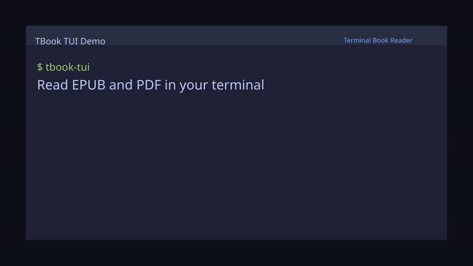

# 📖 TBook TUI

A premium **Terminal Book Reader** built with [OpenTUI](https://opentui.com) — read EPUB & PDF books in your terminal with a modern, visually stunning interface.


## 🎬 10-second demo



MP4: [`assets/tbook-demo-10s.mp4`](assets/tbook-demo-10s.mp4)

## ⚡ Install in 10 seconds

```bash
bun add -g iredox-tbook-tui
tbook-tui
```

## ✨ Features

### 📚 Core Reading
- **EPUB, PDF, MD, & TXT Support** — Full chapter parsing with styled headings, quotes, and paragraphs
- **Library Management** — SQLite-backed book library with search and sorting
- **Reading Progress** — Automatic save/resume with per-book chapter tracking
- **Vim Keybinds** — `j/k` scroll, `h/l` chapters, `space` page-down, `g/G` jump

### 💻 Programming Book Support
- **Syntax Highlighting** — Auto-detects 10+ languages (Rust, Python, JS/TS, Go, Java, C, SQL, Bash…)
- **Code Blocks** — Bordered boxes with language labels, line numbers, and colored syntax
- **Inline Code** — `code` markers rendered with cyan background
- **Code Focus Mode** — `Enter` on a code block opens a non-wrapping horizontal-scroll modal
- **Copy to Clipboard** — `c` copies code blocks or selected text to your system clipboard (OSC 52)
- **Collapse Blocks** — `+` / `-` to collapse/expand long code blocks
- **Callouts/Notes** — Tip, Warning, Note, Important admonitions with colored sidebar

### 🎨 Premium UI
- **Tokyo Night Design** — Dark & Light theme with `T` toggle
- **ASCII Art Splash** — Stunning first-impression branding
- **Gradient Progress Bars** — Color-coded completion tracking
- **Toast Notifications** — Auto-dismissing feedback overlays

### 🔥 Power Features
- **Visual Minimap** — `m` / `M` to toggle a structural sidebar minimap indicating scroll position
- **Text Zoom** — `+`/`-` to adjust reading width (8 zoom levels)
- **Auto-Scroll** — `a` to toggle, `A` to cycle speed (Slow/Normal/Fast/Rapid)
- **Focus Mode** — `f` to hide sidebar & status bar for distraction-free reading
- **Full-Text Search** — `/` to search within the current book with context snippets
- **Chapter TOC Modal** — `t` to jump to any chapter with word counts
- **Bookmarks** — `b` to save, `B` to view/jump-to/delete bookmarks
- **Help Overlay** — `?` for complete keybind reference
- **Book Deletion** — `d` to remove books from library

### ✎ Select & Annotate
- **Select Mode** — `s` enters word cursor for precise text selection
- **Visual Mode** — `v` extends to range selection across paragraphs
- **Highlight Text** — `m` marks selected text with persistent highlights
- **Dictionary Lookup** — `d`/`D` to look up word definitions via free API
- **Vocabulary Tracker** — `V` shows all looked-up words with lookup counts
- **Annotations Panel** — `N` views all highlights with jump-to-source
- **RSVP Speed Reader** — `r` flashes words one at a time (50-1500 WPM)

### 🤖 AI & Utilities
- **AI Assistant** — `E` summarizes the chapter (Normal mode) or explains selections (Select mode)
- **Multi-Provider AI** — Uses local Ollama by default, supports OpenAI via config
- **Text-to-Speech (TTS)** — `p` / `P` reads chapters or selected paragraphs aloud natively
- **Obsidian/Logseq Export** — `X` exports notes & bookmarks as markdown with YAML frontmatter
- **Persistent Config** — Theme, zoom, scroll speed, export format saved to `~/.tbook/config.json`
- **Session Persistence** — All preferences survive between sessions

### 📊 Statistics
- **Reading Stats Dashboard** — Daily word count bar charts
- **Session Tracking** — Words read + minutes recorded per session
- **Streak Counter** — Daily reading streak tracking

### 📂 Smart Import
- **Async Streaming Scan** — Files appear in real-time as they're discovered
- **Multi-Select** — `Space` to check files, batch import with `Enter`
- **Live Search/Filter** — `/` to filter results by name, path, or format
- **Sort Options** — Cycle through name, size, or format sorting with `s`
- **Metadata Preview** — `p` to peek at title, author, chapters, and word count before importing
- **Configurable Depth** — `+`/`-` to adjust scan depth (1-8 levels, persisted)
- **Recent Paths** — Remembers last 10 scanned directories
- **Direct File Import** — Paste a `.epub`/`.pdf` path and press Enter
- **Duplicate Detection** — Warns when a book with the same title+author exists
- **Bulk Progress** — Progress bar with cancel support for batch imports

## 🚀 Quick Start

```bash
# Prerequisites: Bun + Zig
bun install
bun start
```

Or use the published CLI:

```bash
bun add -g iredox-tbook-tui
tbook-tui
```

For PDF support, install `poppler-utils`:
```bash
# Ubuntu/Debian
sudo apt install poppler-utils

# macOS
brew install poppler
```

## 🎮 Controls

### Reader
| Key | Action |
|-----|--------|
| `j` / `k` / `↑` / `↓` | Scroll up/down |
| `Space` | Page down |
| `g` / `G` | Jump to top / bottom |
| `h` / `l` / `←` / `→` | Previous / next chapter |
| `+` / `-` | Zoom text wider / narrower |
| `a` | Toggle auto-scroll |
| `A` | Cycle auto-scroll speed |
| `f` | Toggle focus mode |
| `T` | Toggle dark / light theme |
| `m` / `M` | Toggle visual minimap |
| `p` / `P` | Read chapter aloud (TTS) |
| `t` | Chapter list (TOC modal) |
| `/` | Search in book |
| `b` | Add bookmark |
| `B` | View bookmarks |
| `N` | View annotations & highlights |
| `V` | Vocabulary list |
| `s` | Enter select mode |
| `r` | RSVP speed reader |
| `D` | Dictionary lookup |
| `E` | AI summarize chapter |
| `X` | Export to Obsidian/Logseq |
| `Tab` | Toggle chapter sidebar |
| `?` | Help overlay |
| `q` | Back to library |

### Select Mode
| Key | Action |
|-----|--------|
| `h` / `l` | Move cursor left / right (character/word) |
| `j` / `k` | Move cursor up / down (paragraph) |
| `v` | Toggle visual mode (range select) |
| `m` | Mark / highlight selection |
| `c` | Copy selection or code block to clipboard |
| `+` / `-` | Collapse / expand code block |
| `p` | Read selection aloud (TTS) |
| `d` | Dictionary lookup on word |
| `E` | AI explain selection |
| `Enter` | Confirm selection / Open Code Focus Modal |
| `Esc` | Exit select mode |

### Library
| Key | Action |
|-----|--------|
| `j` / `k` / `↑` / `↓` | Navigate books |
| `Enter` | Open selected book |
| `/` | Search library |
| `n` | Import new books |
| `i` | Reading statistics |
| `d` | Delete selected book |
| `?` | Help overlay |
| `q` | Back to splash |

### Import
| Key | Action |
|-----|--------|
| `Enter` | Scan directory / import selected |
| `a` | Import all found files |
| `j` / `k` / `↑` / `↓` | Navigate file list |
| `Ctrl+d` / `Ctrl+u` | Page down / up (jump 10) |
| `g` / `G` | Jump to top / bottom |
| `Space` | Toggle multi-select checkmark |
| `/` | Search / filter results |
| `s` | Cycle sort (name → size → format) |
| `p` | Preview file metadata |
| `+` / `-` | Increase / decrease scan depth |
| `1` / `2` / `3` | Quick scan Home / Documents / Downloads |
| `4`-`6` | Recent scan paths |
| `e` | Edit scan path |
| `Esc` | Cancel import / close filter |
| `q` | Back to library |

## 📁 Architecture

```
src/
├── app.ts                  # View routing & lifecycle
├── views/
│   ├── splash.ts           # ASCII art welcome screen
│   ├── library.ts          # Book grid with progress cards
│   ├── reader.ts           # Main reading experience
│   ├── import.ts           # File scanner & importer (EPUB + PDF)
│   └── stats.ts            # Reading statistics dashboard
├── components/
│   ├── status-bar.ts       # Bottom bar with progress & keybinds
│   ├── toast.ts            # Auto-dismissing notifications
│   ├── help-overlay.ts     # Full keybind reference modal
│   ├── chapter-toc.ts      # Chapter navigation modal
│   ├── search-modal.ts     # Full-text search with results
│   ├── bookmarks-panel.ts  # Bookmark viewer & manager
│   ├── dictionary-modal.ts # Word definition lookup
│   ├── vocabulary-panel.ts # Vocabulary list with definitions
│   ├── annotations-panel.ts# Highlights & annotations viewer
│   └── rsvp-reader.ts      # RSVP speed reader overlay
├── services/
│   ├── database.ts         # SQLite via bun:sqlite
│   ├── epub-parser.ts      # EPUB → structured chapters
│   ├── pdf-parser.ts       # PDF → chapters via pdftotext
│   ├── export.ts           # Obsidian/Logseq markdown export
│   ├── config.ts           # User config persistence
│   └── dictionary.ts       # Free dictionary API client
└── utils/
    ├── theme.ts            # Tokyo Night Book dual-theme system
    └── html-to-text.ts     # HTML → styled terminal text
```

## 🗄️ Data Storage

All data is stored in `~/.tbook/`:
- `tbook.db` — SQLite database (books, bookmarks, reading stats, highlights, vocabulary)
- `config.json` — User preferences (theme, zoom, export format)

## 📄 License

MIT
